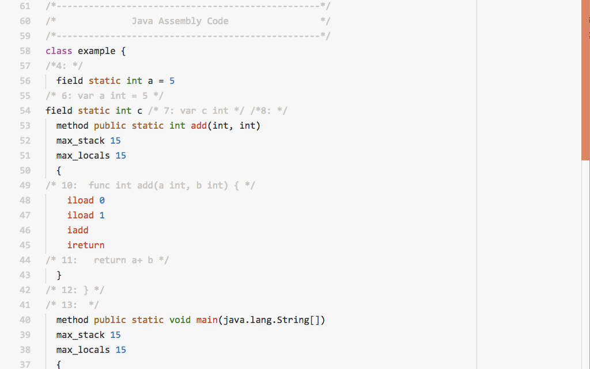

# vscode-jasm

This syntax highlight extension is a minimum support for the Java Assembly Language(`.jasm`). You can find more about the language from [this website](http://www.eg.bucknell.edu/~cs360/java-assembler/).

